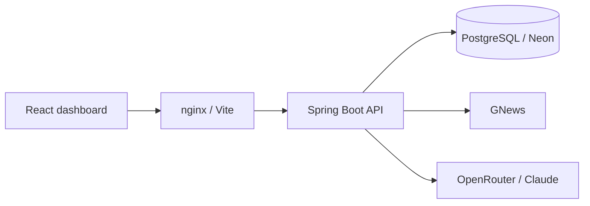
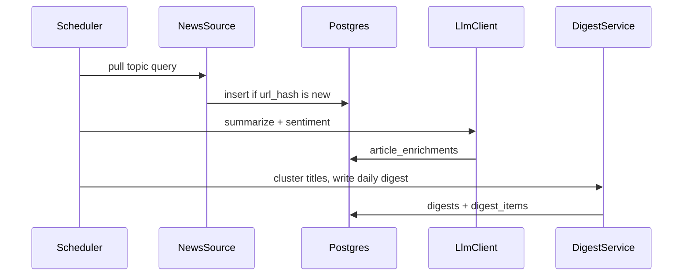
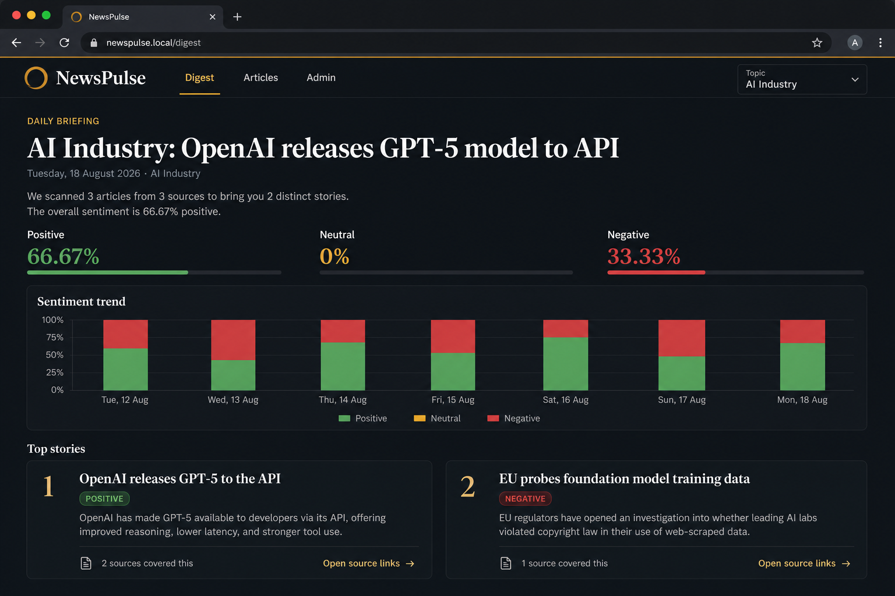
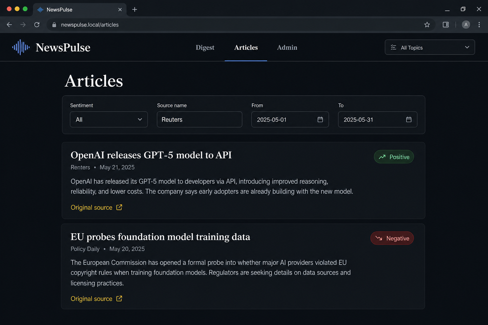

# NewsPulse

AI-native news aggregation and sentiment briefing platform. Java / Spring Boot API with a React dashboard.

[](https://github.com/ahhyang/newspulse/actions/workflows/ci.yml)


NewsPulse pulls articles about a tracked topic (default: **AI industry**), stores them, enriches them with an LLM (summary, sentiment, stance), clusters near-duplicate coverage, and produces a daily digest.

> **Status:** Complete through Phase 7 — Compose stack, dashboard, tests, and docs. Redis/queue/email stay documented as future work.

## Architecture





More detail: [docs/architecture.md](docs/architecture.md)

## Stack

| Layer | Choice | Why |
| --- | --- | --- |
| API | Java 21, Spring Boot 4.1 | Current Spring generation (3.x OSS ended mid-2026). Job listings still say “3.x”; this repo tracks the live platform. |
| HTTP | Spring Web MVC, OpenAPI/Swagger | REST-only contract for the SPA |
| Persistence | Spring Data JPA + Flyway | Versioned schema; Hibernate `ddl-auto=validate` only |
| Database | PostgreSQL 16 locally, Neon in prod | Neon is Postgres. Same dialect in Compose and cloud. |
| Auth | JWT (admin writes) | Public read APIs for the dashboard |
| News | GNews behind `NewsSource` | First live source; RSS can be added without touching persist/digest logic |
| LLM | OpenRouter (`LlmClient`) | Claude (or other) models without locking the code to one vendor SDK |
| Frontend | React + TypeScript + Vite + Tailwind | REST-only SPA; deploy to Vercel |
| Packaging | Docker Compose | `db` + `api` + `frontend` (nginx reverse-proxies `/api`) |

## Dashboard





Public reads need no login. **Admin** signs in with `APP_ADMIN_*` to ingest, enrich, generate a digest, and manage topics.

## Local setup

**Prereqs:** Docker Desktop. JDK 21 / Node 22 are only needed outside Compose.

```bash
cp .env.example .env
# fill GNEWS_API_KEY, OPENROUTER_API_KEY, JWT_SECRET, APP_ADMIN_PASSWORD
docker compose up --build
```

| Service | URL |
| --- | --- |
| Dashboard | http://localhost |
| API | http://localhost:8080 |
| Swagger | http://localhost:8080/swagger-ui.html |
| Health | http://localhost:8080/actuator/health |

nginx serves the SPA and proxies `/api` to the API container (same-origin). If port 80 is taken, change the frontend mapping in `docker-compose.yml` to `"8088:80"`.

### First briefing

1. Open http://localhost → **Admin**
2. Sign in with `APP_ADMIN_USERNAME` / `APP_ADMIN_PASSWORD`
3. **Ingest now** → **Enrich pending** → **Generate today's digest**
4. Open **Digest** (empty until those runs finish)

### Frontend hot-reload (optional)

```bash
docker compose up db api
cd frontend && npm install && npm run dev
```

Vite on http://localhost:5173 proxies `/api` to `:8080`.

### Tests

```bash
cd backend && ./mvnw -B verify
cd ../frontend && npm test && npm run build
```

Testcontainers ITs skip automatically if Docker is not running (`disabledWithoutDocker = true`). GitHub Actions has Docker, so they run in CI.

## API

| Method | Path | Auth |
| --- | --- | --- |
| `POST` | `/api/auth/login` | public |
| `GET` | `/api/topics` | public |
| `POST` | `/api/topics` | JWT admin |
| `PATCH` | `/api/topics/{id}` | JWT admin |
| `POST` | `/api/ingestion/runs` | JWT admin |
| `POST` | `/api/enrichment/runs` | JWT admin |
| `POST` | `/api/digests/runs` | JWT admin |
| `GET` | `/api/articles` | public, filterable |
| `GET` | `/api/digests/latest` | public |
| `GET` | `/api/digests/{date}` | public, optional `topicId` |
| `GET` | `/api/stats` | public, optional `topicId`/`from`/`to` |
| `GET` | `/swagger-ui.html` | public |

Error body is consistent (`status`, `error`, `message`, `path`, `details`). See [docs/api.md](docs/api.md).

## Repo layout

```
backend/    Spring Boot 4.1 API (Flyway, JWT, GNews, OpenRouter)
frontend/    React + Vite + Tailwind SPA
docs/        architecture, API notes, AI-workflow, screenshots
docker-compose.yml
```

## Hosting

| Piece | Local | Production |
| --- | --- | --- |
| API | Compose / `mvn spring-boot:run` | JVM host (Railway/Render). **Vercel cannot run Spring Boot.** |
| Database | Postgres 16 in Compose | [Neon](https://neon.tech) — set `DATABASE_URL` |
| Frontend | nginx `:80` or Vite `:5173` | Vercel — set `VITE_API_URL` to the API origin |

The API accepts Neon-style `postgres://` URLs and maps them to JDBC. Do not also set `SPRING_DATASOURCE_URL` if you want `DATABASE_URL` to win.

## Secrets

Keys live in `.env` (gitignored). `.env.example` is the template. If a key was ever pasted into chat, email, or a screenshot, **rotate it** in GNews and OpenRouter and update `.env`.

## Future improvements (called out on purpose)

- Redis cache for digest payloads
- Durable queue (Kafka or at least an outbox) for the ingest → enrich pipeline
- SMTP daily digest
- Additional `NewsSource` adapters (RSS is the obvious next source)

## How I used AI tools

This is a portfolio piece for a Java / Spring Boot role. Cursor was a pair-programmer, not an unsupervised generator.

**Where it helped**

- Bootstrapped the Spring Boot 4.1 Maven layout, Dockerfiles, Compose wiring, and the GitHub Actions workflow.
- Drafted repetitive layers: JPA entities matching Flyway, request/response records, `@ControllerAdvice`.
- First-pass unit tests (`TopicService`, `AuthService`), which I then tightened around duplicate names and JWT claims.
- First-pass Vite routes / API client / Recharts wiring, which I restyled as an editorial briefing instead of a generic admin template.

**Decisions I made myself**

- Domain: topics → articles → enrichments → clusters → digests, with **URL-hash** uniqueness (not title matching).
- `NewsSource` / `LlmClient` ports so GNews and OpenRouter can be swapped without touching digest logic.
- PostgreSQL + Neon instead of MySQL, because the live database target is Neon.
- JWT for admin writes; public GETs so a briefing is readable without a login wall.
- Vercel for the SPA only. The API stays on a JVM host; that constraint is documented rather than papered over.
- Title Jaccard clustering (threshold 0.45) as a cheap, deterministic stand-in for embeddings.

**What I did not outsource:** Flyway schema, the security filter chain, and production flags (`ddl-auto=validate`, `open-in-view=false`, virtual threads, CORS).

Longer notes: [docs/ai-workflow.md](docs/ai-workflow.md)

## License

MIT
