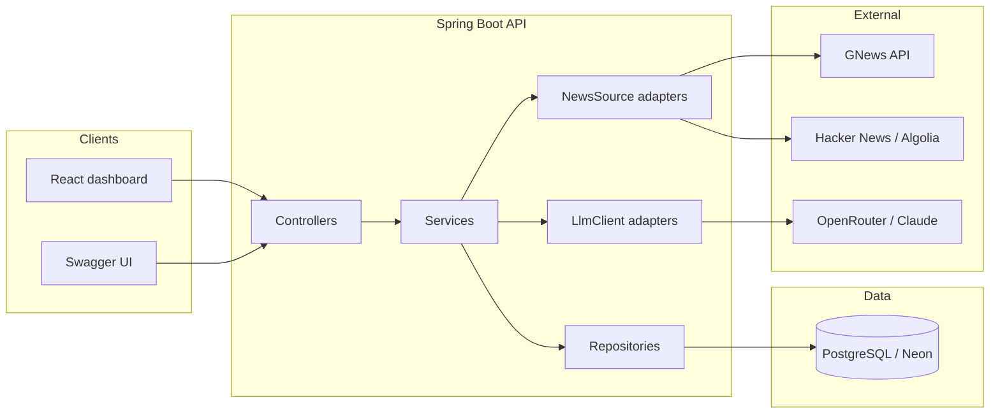

# NewsPulse architecture

## Runtime view

## Layering

- `web` — REST controllers, `@ControllerAdvice`, DTO in/out
- `service` — use cases (topics, articles, ingest, enrich, digest)
- `repository` — Spring Data JPA only
- `domain` — JPA entities, never returned from controllers
- `ingestion.NewsSource` — one class per news provider
- `llm.LlmClient` — one class per LLM provider (OpenRouter default)
- `clustering` — title Jaccard + content-hash union-find so a digest item can say “N sources covered this”

Digest window is the UTC calendar day. Only **enriched** articles are included. Near-duplicate headlines are grouped before ranking (distinct `sourceName`, then recency). Template headline/overview for now; an LLM compose step can sit behind the same `DigestService` later.

Flyway owns schema. `spring.jpa.hibernate.ddl-auto=validate` in every profile.

## Hosting

| Piece | Local | Production |
| --- | --- | --- |
| API | Docker / `mvn spring-boot:run` | JVM host (Railway/Render). Vercel cannot run Spring Boot. |
| Database | Postgres 16 in Compose | Neon (set `DATABASE_URL`) |
| Frontend | nginx in Compose (`:80`, proxies `/api`) or Vite `:5173` | Vercel (`VITE_API_URL` → API origin) |

A clean machine needs Docker Desktop and a filled `.env`. `docker compose up --build` starts Postgres, the API, and the dashboard.

## Processing pipeline

1. **Ingest** — each `NewsSource` (GNews + Hacker News Algolia) searches every active topic; URL SHA-256 after normalization is the uniqueness key. HTTP stays outside the DB transaction.
2. **Enrich** — `OpenRouterLlmClient` writes summary, sentiment, justification, stance. Per-article failures are counted and skipped.
3. **Cluster** — unclustered articles are union-find grouped by identical `contentHash` or title Jaccard ≥ `app.digest.cluster-similarity`.
4. **Digest** — UTC calendar day, enriched articles only, ranked by distinct `sourceName` then recency. Scheduler writes yesterday at 00:05 UTC.

Redis caching and a durable processing queue are documented future work.
